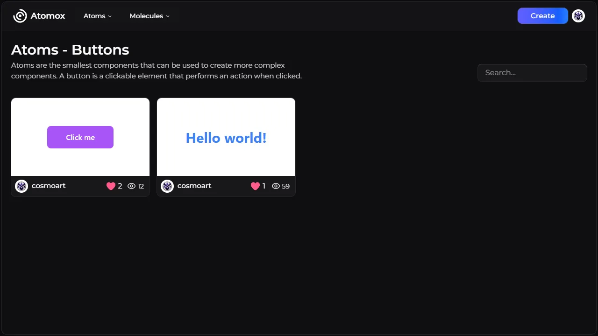

<div id="top"></div>

<div align="center">
<a href="https://atomox.vercel.app"></a>
<br/>
<br />

# 🧬 Atomox ⚛️

Atomox is a collaborative platform where developers and designers can share, explore, and give feedback on reusable web components. Built for the [Clerk x Midudev hackathon](https://github.com/midudev/hackaton-clerk-2025), Atomox makes it easy to get feedback and inspire others with your UI creations.

  <a href="https://atomox.vercel.app">View Website</a>
  ·
  <a href="https://github.com/cosmoart/atomox/issues/new">Report Bug</a>
  ·
  <a href="https://github.com/cosmoart/atomox/issues/new">Request Feature</a>
</div>


<!-- TABLE OF CONTENTS -->
<details>
<summary>Table of contents</summary>

- [About The Project](#about-the-project)
- [Screenshots](#screenshots)
- [Built With](#built-with)
- [Getting Started](#getting-started)
- [Roadmap](#roadmap)
- [License](#license)
- [Contact](#contact)
</details>

<!-- ABOUT THE PROJECT -->
## About The Project

Atomox is a collaborative platform where developers and designers can share, explore, and give feedback on reusable web components. Whether you're looking to discover creative UI ideas, contribute your own components, or get constructive feedback from the community, Atomox is your playground for modern, component-based web design.

<p align="right"><a href="#top">⬆️ Back to top</a></p>


<!-- SCREENSHOTS -->
## 📸 Screenshots

<table>
    <tr>
      <td>
          
      </td>
      <td>
          
      </td>
    </tr>
        <tr>
      <td>
          
      </td>
      <td>
          
      </td>
    </tr>
</table>

<p align="right"><a href="#top">⬆️ Back to top</a></p>

### 🛠️ Built With

List of the frameworks, libraries and tools used to build this project.

* [Clerk](https://clerk.com/) For authentication
* [Next.js](https://nextjs.org/)
* [Supabase](https://supabase.com/) For database & storage
* [React.js](https://reactjs.org/)
* [shadcn/ui](https://ui.shadcn.com/) For the design system
* [React Monaco Editor](https://github.com/suren-atoyan/monaco-react) For the code editor
* [Lucide](https://lucide.dev/) For icons
* [Vercel](https://vercel.com/) For hosting
* [Tailwind CSS](https://tailwindcss.com/) For styling
* [Figma](https://www.figma.com/) For layouts and design
* [Canvas confetti](https://www.npmjs.com/package/canvas-confetti) For the confetti animation
* [React Hook Form](https://react-hook-form.com/) For form validation
* [Zod](https://zod.dev/) For form validation
* [next-themes](https://github.com/pacocoursey/next-themes) For dark mode

<p align="right"><a href="#top">⬆️ Back to top</a></p>


<!-- GETTING STARTED -->
## ⚙️ Getting Started

1. Clone or fork the repo
```sh
git clone https://github.com/cosmoart/atomox
```
1. Install NPM packages
```sh
npm install
```
3. Run the project
```sh
npm run dev
```

<p align="right"><a href="#top">⬆️ Back to top</a></p>


<!-- ROADMAP -->
## 🎯 Roadmap

Proposed features that may or may not be implemented in the future.

- [ ] Comments section
- [ ] User achievements, description & links.
- [ ] Components from other frameworks (React, Vue, Angular, etc.)
- [ ] Tailwind autocomplete
- [x] Verified user role ~~(Its components are published immediately.)~~
- [ ] Licenses or credits for the components
- [ ] Zoom in/out in components

<p align="right"><a href="#top">⬆️ Back to top</a></p>

<!-- LICENSE -->
## 📜 License

Distributed under the Apache License 2.0. See [`LICENSE.txt`](https://github.com/cosmoart/atomox/blob/main/LICENCE) for more information.

<p align="right"><a href="#top">⬆️ Back to top</a></p>

<!-- CONTACT -->
## 📩 Contact

-   My website - [cosmoart.dev](https://cosmoart.dev)
-   Twitter - [@cosmoart0](https://twitter.com/cosmoart0)
-   Instagram - [@cosmoart0](https://www.instagram.com/cosmoart0/)

<p align="right"><a href="#top">⬆️ Back to top</a></p>